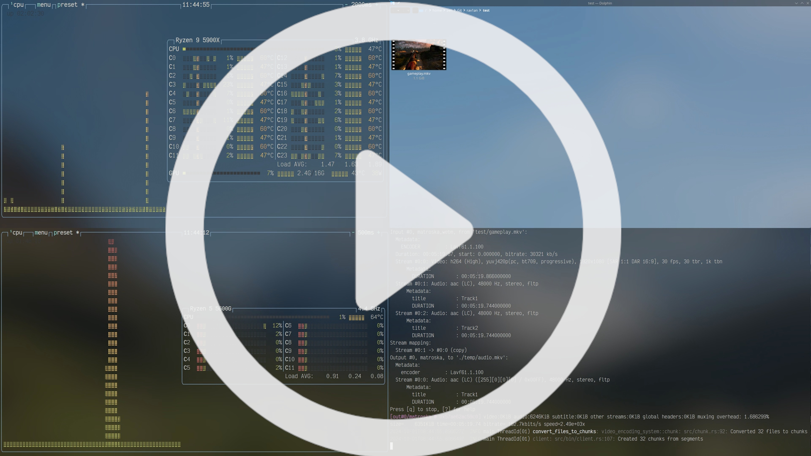

# Video Encoding System
A distributed video encoding system built with Rust, gRPC, and FFmpeg.

## Showcase

In this example I transcode couple of minutes of gameplay that I recorded on  2 nodes that are setup on different computers

[](https://www.youtube.com/watch?v=mxG5Y8sUAo)


## Key Features

* Distributed processing across multiple nodes
* Configurable via CLI and config files
* Robust error handling 
* gRPC communication with compression
* Efficient temporary file management
* Automatic video segmentation and concatenation
* Extensive logging with tracing

## Main Problem

Main problem that this project solves is distributing even increasing requirements for video encoding accross multiple computers to utilize more compute power.


### Quick Start

Start encoding node(s):
`cargo run --bin node -- -a 127.0.0.1:50051`

Run client:
`cargo run --bin client -- - input.mp4 -o output.mp4 --nodes 127.0.0.1:50051 --slots 4`

### Example with multiple nodes

#### Run nodes:

`RUST_LOG=info cargo run --release --bin node -- -n 0.0.0.0:50051 -t 50051`

#### Run client:

`RUST_LOG=info cargo run --release --bin client -- -n "http://127.0.0.1:50051"  -n "http://192.168.0.196:50051"  --input-file "test/gameplay.mkv" --slots 2 --slots 2   --output-file "test/vid.mkv"  --encoder-params " -c:v libx264 -preset slower -crf 23"`


## Usage

Client starts and tries to connect to all nodes.
If connection is successful, client gives each node number of chunks to encode equal to specified slots for that node.
After completing encode, node send chunk back to client.

After all chunks are encoded, all chunks are concatenated into final file and all non-video streams are added back.

It's important to notice chat encode parameters takes ffmpeg parameters for encoding.
So syntax syntax is identical between them.
For example : `--encoder-params " -c:v libx264 -preset slower -crf 23"`
will encode file to AVC with those settings.


### Client
```
Usage: client [OPTIONS] --input-file <INPUT_FILE> --output-file <OUTPUT_FILE>

Options:
  -i, --input-file <INPUT_FILE>
          Input video file path
  -o, --output-file <OUTPUT_FILE>
          Output video file path
      --config-file <CONFIG_FILE>
          Path to the configuration file
  -n, --nodes <NODES>
          List of node addresses
      --slots <SLOTS>
          List of slot numbers corresponding to each node
      --encoder-params <ENCODER_PARAMS>
          Encoder parameters, that include encoder and parameters for it
      --temp-dir <TEMP_DIR>
          Temporary directory for processing
      --segment-duration <SEGMENT_DURATION>
          Duration of each video segment in seconds
  -h, --help
          Print help
  -V, --versionc
          Print version
```

### Node

```
Usage: node [OPTIONS]

Options:
  -c, --config-file <CONFIG_FILE>  Path to the configuration file
  -n, --node <NODE>                Node address
  -t, --temp-dir <TEMP_DIR>        Temporary directory for processing
  -h, --help                       Print help
  -V, --version                    Print version
```
